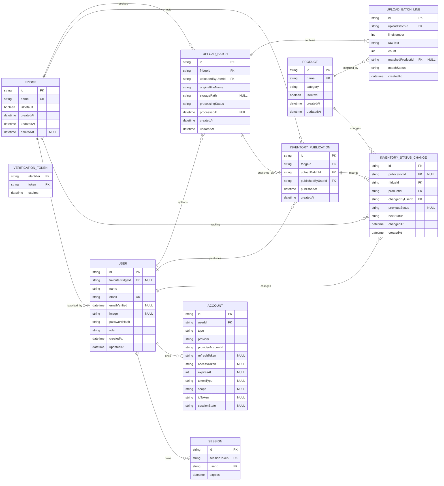

# 在庫データモデル

このドキュメントは、現行の在庫データモデルを説明する。

このモデルの中心は、商品ごとの個別確認ではなく、レビュー済み納品書を現在在庫として公開することにある。
また、複数の冷蔵庫ごとの在庫を独立して管理し、ユーザーはその中からお気に入りの冷蔵庫を1つ選択して登録することができる。

## ER図

Nullable カラムには `"NULL"` コメントを付与する。`USER`、`ACCOUNT`、`SESSION`、`VERIFICATION_TOKEN` は Auth.js の OAuth・セッション・メールトークン用アダプタテーブルである。

## Fridge と お気に入り冷蔵庫

`Fridge` は複数の冷蔵庫を管理するマスタテーブルである。`isDefault` フラグを用いて、デフォルトとして扱う冷蔵庫（例: 「16F」の冷蔵庫）を定義する。
また、冷蔵庫の削除要件に対しては過去の履歴（納品書やステータス変更履歴）の参照整合性を保護するため、物理削除ではなく `deletedAt` を用いた **論理削除** を採用する。

ユーザーは、システムに存在する `Fridge` の中から自身がよく確認する冷蔵庫を1つだけ「お気に入り」として選択・登録することができる。この情報は `USER` テーブルの `favoriteFridgeId` に保存される（未選択の場合は `NULL`）。

## Product

`Product` は商品マスタである。トップページに表示する名前とカテゴリの権威データを持つ。

現在在庫そのものは `Product` に保持しない。現在状態は `CurrentInventory` が保持し、`Product` は名称とカテゴリの権威データを提供する。

## UploadBatch

`UploadBatch` は1回の納品書読み取り単位である。対象となる冷蔵庫を特定するために `fridgeId` を保持する。

ここには元ファイル名、処理状態、レビュー済み商品行が属する。`UploadBatch` 自身は現在公開中かどうかを保持しない。

`processingStatus` は読み取りとレビュー準備の状態だけを表す。現在は `PENDING`、`PROCESSED`、`FAILED` を使う。

## UploadBatchLine

`UploadBatchLine` は納品書から確定した1商品行である。

このテーブルの `count` は納品書読み取りで得た根拠数量である。ユーザはこの数量を手動更新しない。

納品書反映時の `PLENTIFUL`、`FEW_LEFT`、`SOLD_OUT` は、この数量から導出する。

`matchedProductId` が空の行は、まだ商品マスタへの紐付けが確定していない。

## InventoryPublication

`InventoryPublication` は、ある `UploadBatch` を対象の冷蔵庫のトップページ在庫へ反映した出来事を表す。

`InventoryPublication` は履歴と監査の境界であり、トップページの現在表示を直接導出する責務は持たない。
クエリを最適化し、特定の冷蔵庫の最新公開を高速に引くために、直接 `fridgeId` を保持（非正規化）する。

公開履歴は追記型である。過去バッチを再公開する場合も、既存レコードを書き換えず、新しい `InventoryPublication` を追加する。

`publishedByUserId` が、現在在庫へ切り替えた人を表す。

## InventoryStatusChange

`InventoryStatusChange` は、ユーザ可視の状態変更だけを記録する。対象となる冷蔵庫を特定するために `fridgeId` を保持する。

このテーブルは数量差分の監査ログではない。数量が変わっても導出ステータスが同じなら記録しない。

納品書反映では、その納品書に含まれる商品のうち導出ステータスが変わったものだけを記録する。納品書に存在しない商品を `SOLD_OUT` として扱わない。

トップページの商品カードから手動で状態を変更した場合も、このテーブルに記録する。その場合、`publicationId` は `NULL` になる。

## CurrentInventory

`CurrentInventory` は、冷蔵庫と商品の組み合わせごとの現在状態を1行で保持する。

このテーブルは `count`、`status`、`isVisible`、`lastPublishedAt`、最終状態変更者情報を持つ。

トップページ在庫は `CurrentInventory` から `fridgeId` と `isVisible = true` で直接取得する。

納品書反映時は対象商品を upsert し、反映対象外の商品は `isVisible = false` に更新する。

## 現在在庫の導出

1. 特定の冷蔵庫（`fridgeId`）に対する `CurrentInventory` を取得する。
2. `isVisible = true` の行をトップページ表示対象にする。
3. 表示状態は `CurrentInventory.status` を使用する。
4. 商品名とカテゴリは `Product` を参照する。

## 変更者追跡

各冷蔵庫のトップページ下部には、最新 `InventoryPublication` の反映者、反映日時、元ファイル名、納品書反映で状態が変わった商品を表示する。

最新反映後に手動変更された商品があれば、誰がいつどの商品をどの状態へ変更したかを別枠で表示する。

商品カードには `CurrentInventory` が保持する最終状態変更者と最終状態変更時刻を表示する。

状態が変わっていない商品に対して、最新公開者を一律に最終変更者として表示しない。

## パフォーマンス最適化（インデックス設計）

すべてのデータアクセスが「特定の冷蔵庫（タブ）」の絞り込みを起点とするため、パフォーマンス劣化を防ぐための複合インデックスを以下の通り設計する。

1. `CurrentInventory`: `[fridgeId, isVisible]`
   * 特定の冷蔵庫の表示対象を単純な条件で読み取るため。
2. `InventoryPublication`: `[fridgeId, publishedAt DESC]`
   * 公開サマリと履歴参照で最新公開を特定するため。
3. `InventoryStatusChange`: `[fridgeId, productId, changedAt DESC]`
   * 状態変更履歴の最新追跡と監査ログ参照を高速化するため。

## 設計上の判断

`InventoryCheck` は現行モデルに存在しない。

このアプリケーションでは、現在在庫を商品ごとの独立観測で積み上げるのではなく、特定の冷蔵庫に対するレビュー済み納品書の反映イベントと、冷蔵庫・商品別状態変更履歴で表現するためである。

この論理構造と非正規化・インデックスの最適化により、現在在庫の真実源、公開者の追跡、再公開履歴、商品別状態変更ログの責務が明確かつ高速に分離される。
