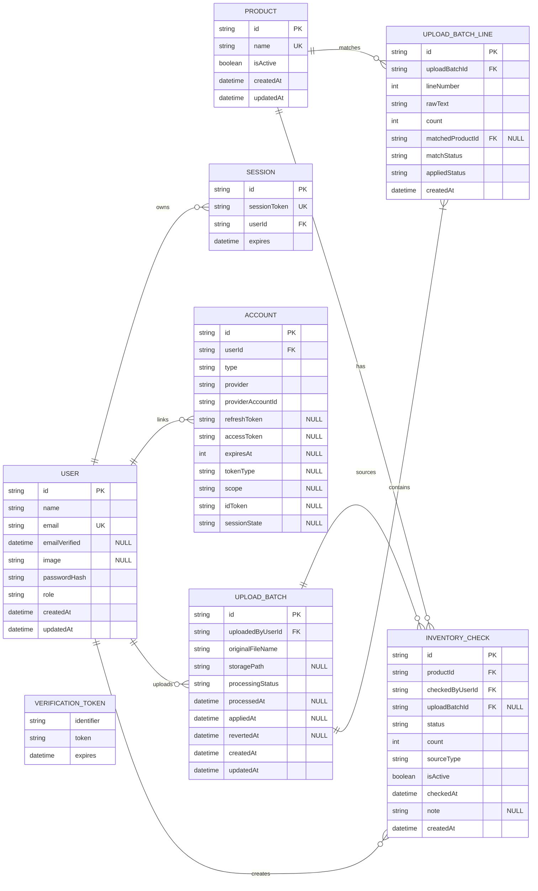

# Inventory ERD in Mermaid

This document provides the same inventory model as a Mermaid `erDiagram`.

Nullable columns are marked with a `"NULL"` comment. Required columns omit nullability.

`USER` follows Auth.js-compatible fields. `ACCOUNT`, `SESSION`, and `VERIFICATION_TOKEN` represent Auth.js adapter tables for OAuth, database sessions, and email tokens.

Notes:

- Current inventory is derived from the latest active `INVENTORY_CHECK` for each `PRODUCT`.
- `FEW_LEFT` means 1 to 5 items remaining.
- `UPLOAD_BATCH_LINE` represents extracted product candidates from one upload, not a persistent property of `PRODUCT`.
- Credentials + JWT uses `USER` for authentication state. OAuth uses `ACCOUNT`, database sessions use `SESSION`, and email-token flows use `VERIFICATION_TOKEN`.
- `VERIFICATION_TOKEN` is an independent token table and does not reference `USER`.
