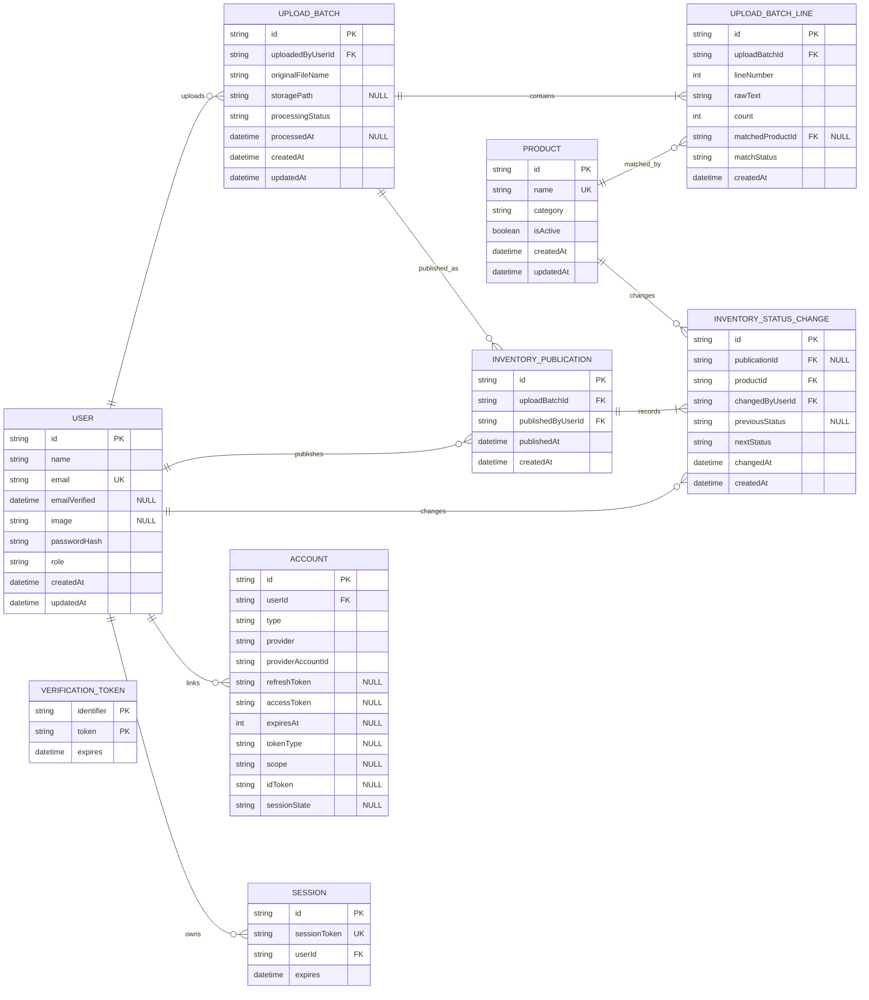

# Inventory ERD in Mermaid

This document provides the current inventory model as a Mermaid `erDiagram`.

Nullable columns are marked with a `"NULL"` comment. Required columns omit nullability.

`USER` follows Auth.js-compatible fields. `ACCOUNT`, `SESSION`, and `VERIFICATION_TOKEN` represent Auth.js adapter tables for OAuth, database sessions, and email tokens.

Notes:

- Current inventory uses the latest `INVENTORY_PUBLICATION` to select the applied delivery note and its reviewed lines.
- `UPLOAD_BATCH` represents a reviewed delivery note, not the currently active inventory by itself.
- `INVENTORY_PUBLICATION` is append-only. Re-publishing an old batch creates a new publication row.
- `INVENTORY_STATUS_CHANGE` records only user-visible status transitions. Quantity-only movement is not a change log event.
- Product status is derived from `count`; `FEW_LEFT` means 1 to 5 items remaining.
- `VERIFICATION_TOKEN` is an independent token table and does not reference `USER`.
