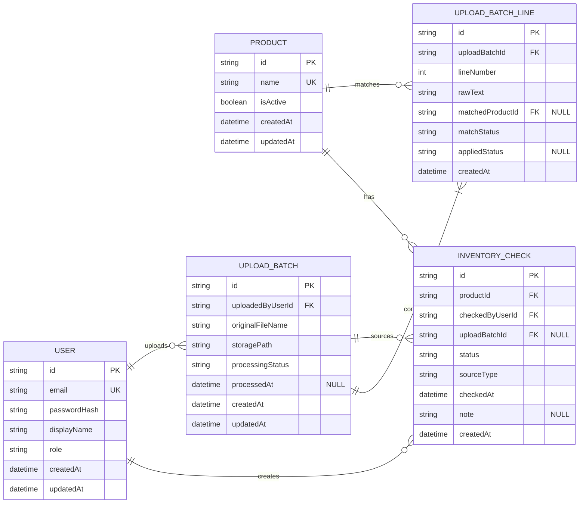

# Inventory ERD in Mermaid

This document provides the same inventory model as a Mermaid `erDiagram`.

Nullable columns are marked with a `"NULL"` comment. Required columns omit nullability.

Notes:

- Current inventory is derived from the latest `INVENTORY_CHECK` for each `PRODUCT`.
- `FEW_LEFT` means 1 to 5 items remaining.
- `UPLOAD_BATCH_LINE` represents extracted product candidates from one upload, not a persistent property of `PRODUCT`.
